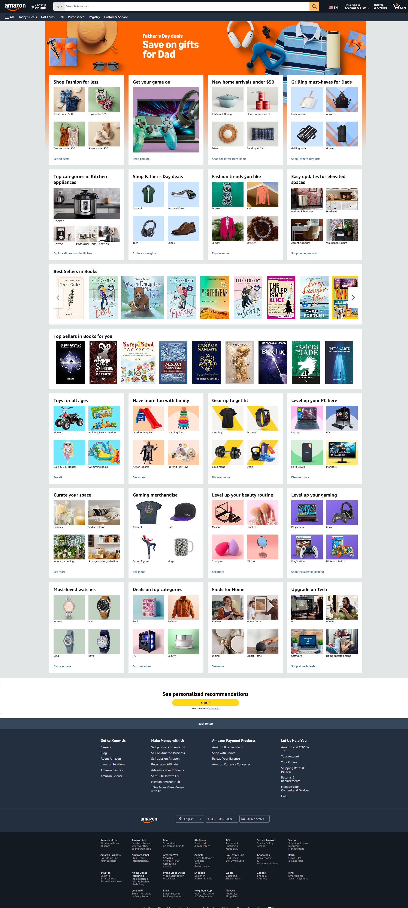

# Amazon E-Commerce Website Clone

A frontend e-commerce website inspired by the Amazon online shopping experience.

## 🚀 Live Demo

**[View Live Website](https://natoltesfaye.github.io/amazon-website-clone./)**

## 📸 Project Screenshot



## 📖 About the Project

This project is an educational e-commerce website created to practice and improve frontend web development skills.

It recreates the structure and visual experience of an online shopping platform, including navigation, product sections, search, categories, and shopping-related UI elements.

## ✨ Features

- 🛒 E-commerce shopping interface
- 🔍 Search bar
- 📦 Product listings
- 🏷️ Product categories
- 🖼️ Product images
- 🛍️ Shopping-focused UI
- 📱 Responsive layout

## 🛠️ Technologies Used

- HTML5
- CSS3
- JavaScript

## 📂 Project Structure

```text
amazon-website-clone/
├── images/
│   ├── icon/
│   └── logo.png
├── style/
│   └── style.css
├── index.html
├── SCREENSHOT.png
├── README.md
└── .gitignore
